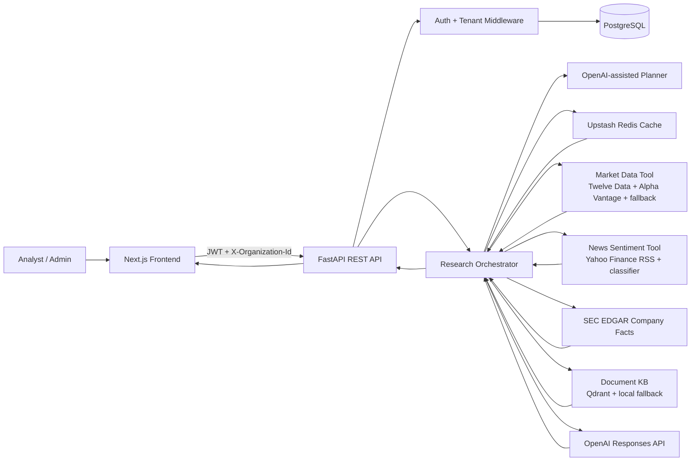
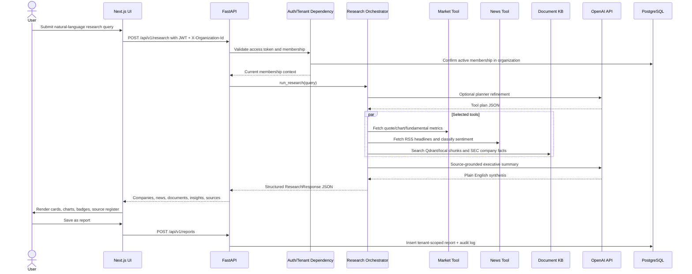
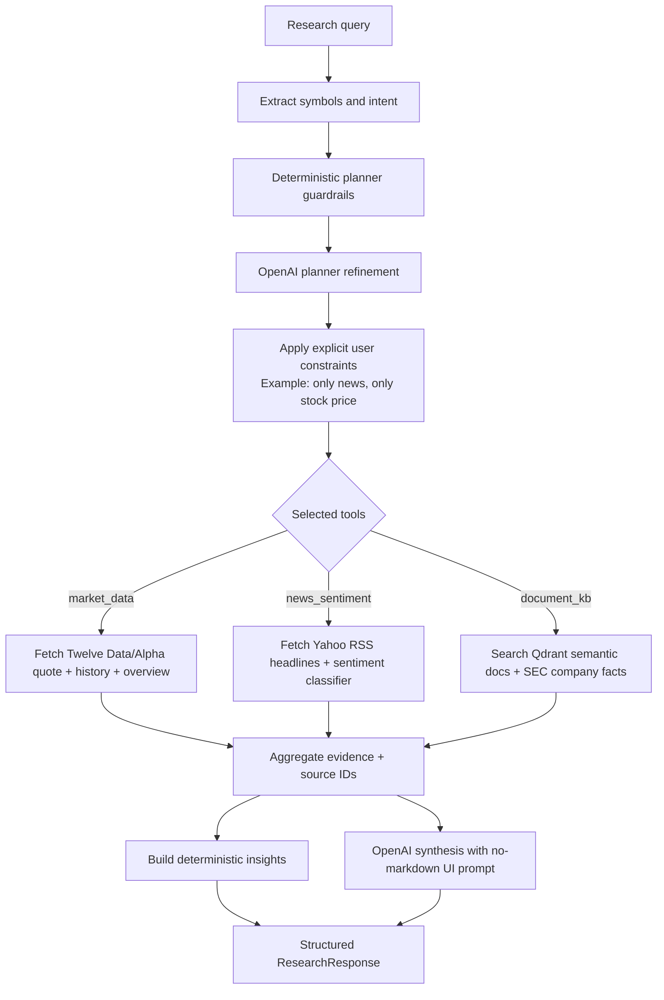
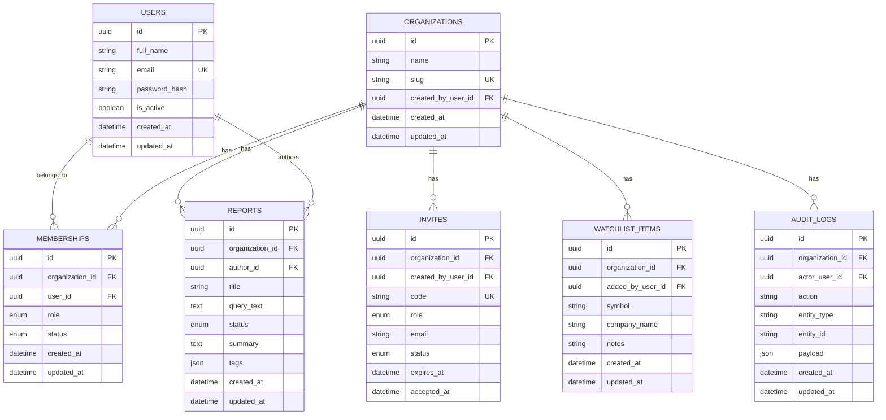
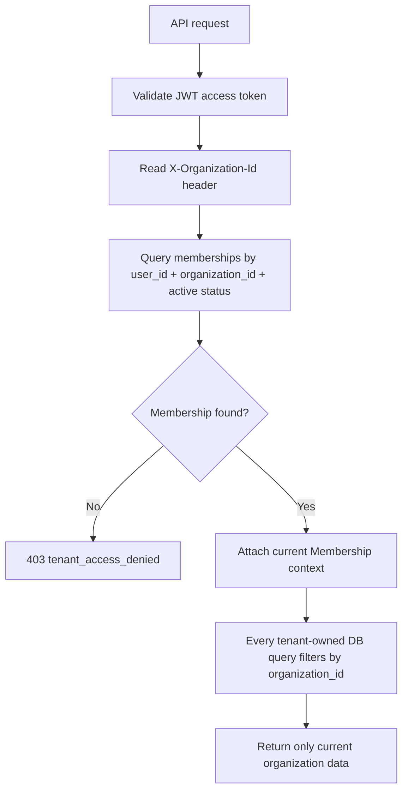

# Architecture

## System Overview

Klypup Research OS is a full-stack, multi-tenant investment research dashboard. The frontend is a Next.js app. The backend is a FastAPI REST API. PostgreSQL stores users, organizations, memberships, saved reports, watchlists, invites, and audit logs. The AI research layer selects data tools dynamically, fetches external market/news/SEC data, searches Qdrant-backed RAG when configured, caches expensive tool calls in Upstash Redis, and uses OpenAI for concise source-grounded synthesis.



## Frontend Architecture

The frontend is organized around a protected dashboard:

- `src/app/page.tsx`: public landing page.
- `src/app/login/page.tsx` and `src/app/signup/page.tsx`: authentication screens.
- `src/app/dashboard/page.tsx`: session gate and dashboard bootstrap.
- `src/components/workspace-dashboard.tsx`: main workspace UI, CRUD forms, filters, pagination, and mini AI launcher.
- `src/components/research-studio.tsx`: dedicated AI research page with chat, previous history, and tabbed evidence.
- `src/components/floating-agent-launcher.tsx`: mini AI chat and live research status.
- `src/components/research-results.tsx`: structured AI output cards, charts, news, RAG snippets, sources.
- `src/lib/api.ts`: API client, session storage, token refresh, friendly error messages.

The browser never calls OpenAI directly. It only calls the backend API.

## Backend Architecture

The backend follows a route/schema/model/service split:

- `app/api/routes/*`: REST endpoints.
- `app/api/deps.py`: auth, tenant resolution, role checks.
- `app/models/*`: SQLAlchemy models.
- `app/schemas/*`: Pydantic request/response models.
- `app/services/research/*`: AI planner, tools, Upstash cache, Qdrant/local document KB.
- `app/core/*`: config, database, security, error handling.
- `app/scripts/seed_demo.py`: deterministic demo data.

## User Research Data Flow



## AI Orchestration Flow



Tool selection examples:

| Query | Expected tools |
| --- | --- |
| `Show only NVIDIA latest stock price...` | `market_data`, `llm_synthesis` |
| `Summarize only recent news sentiment for Tesla...` | `news_sentiment`, `llm_synthesis` |
| `Analyze NVIDIA earnings report details from filings...` | `document_kb`, `llm_synthesis`, plus market/news if the planner deems them relevant |
| `Compare JPMorgan, Goldman Sachs, and Morgan Stanley balance sheets...` | `market_data`, `document_kb`, `llm_synthesis` |

## Document Knowledge Base

The document KB uses a hybrid setup:

1. Sample SEC/earnings-style excerpts for NVDA, AMD, INTC, TSLA, JPM, GS, and MS live in `knowledge_base.py`.
2. Documents are chunked with a small overlap.
3. When `QDRANT_URL` and `QDRANT_API_KEY` are configured, chunks are converted into deterministic document vectors and upserted into Qdrant.
4. Document queries search Qdrant first, then fall back to the local cosine index if Qdrant is unavailable.
5. SEC EDGAR companyfacts are fetched for document/fundamental questions when `SEC_USER_AGENT` is configured.
6. Results return snippets and source references.

This keeps the demo reliable while still showing the production vector DB path.

## Database Schema



Important constraints and indexes:

- `users.email` is unique and indexed.
- `organizations.slug` is unique and indexed.
- `memberships` has a unique `(organization_id, user_id)` constraint.
- `watchlist_items` has a unique `(organization_id, symbol)` constraint.
- Tenant-owned tables index `organization_id`.
- Reports index `author_id`; watchlist items index `symbol` and `added_by_user_id`.

## Multi-Tenant Data Flow



Tenant enforcement pattern:

- Frontend stores the active membership after login.
- API requests include `Authorization: Bearer <token>` and `X-Organization-Id: <org id>`.
- `get_current_membership` validates the token and confirms the user belongs to that organization.
- Routes receive the membership and scope every report/watchlist/dashboard query with `membership.organization_id`.
- If a user attempts another org ID, the API returns `403 tenant_access_denied`.

## RBAC

Roles:

- `admin`: manages organizations and creates invites.
- `analyst`: creates research, reports, and watchlist items in their organization.

The `require_roles(...)` dependency protects admin-only actions such as invite creation.

## API Design

All endpoints are under `/api/v1`.

| Method | Endpoint | Auth | Tenant Header | Purpose |
| --- | --- | --- | --- | --- |
| `GET` | `/health` | No | No | Health check |
| `POST` | `/auth/signup` | No | No | Create user + organization |
| `POST` | `/auth/login` | No | No | Login and receive access/refresh tokens |
| `POST` | `/auth/refresh` | No | No | Refresh session |
| `GET` | `/auth/me` | Yes | No | Current user and memberships |
| `GET` | `/dashboard` | Yes | Yes | Workspace stats/recent data |
| `POST` | `/research` | Yes | Yes | Run AI research orchestration |
| `GET` | `/reports` | Yes | Yes | List tenant reports with search/status/tag filters |
| `POST` | `/reports` | Yes | Yes | Create saved report |
| `GET` | `/reports/{id}` | Yes | Yes | Read report if tenant owns it |
| `PATCH` | `/reports/{id}` | Yes | Yes | Update report if tenant owns it |
| `DELETE` | `/reports/{id}` | Yes | Yes | Delete report if tenant owns it |
| `GET` | `/watchlist` | Yes | Yes | List tenant watchlist |
| `POST` | `/watchlist` | Yes | Yes | Add company to watchlist |
| `PATCH` | `/watchlist/{id}` | Yes | Yes | Update watchlist item |
| `DELETE` | `/watchlist/{id}` | Yes | Yes | Delete watchlist item |
| `GET` | `/organizations` | Yes | No | List memberships for current user |
| `POST` | `/organizations` | Yes | No | Create new organization |
| `POST` | `/organizations/invites` | Admin | Yes | Create invite code |
| `POST` | `/organizations/join` | Yes | No | Join with invite code |

### Research Request

```json
{
  "query": "Show only NVIDIA latest stock price, volume, P/E, revenue, EPS, and recent price performance."
}
```

### Research Response Shape

```json
{
  "query": "string",
  "generated_at": "ISO timestamp",
  "latency_ms": 5741,
  "plan": {
    "symbols": ["NVDA"],
    "tools": ["market_data", "llm_synthesis"],
    "rationale": "..."
  },
  "executive_summary": "Plain English summary",
  "companies": [],
  "news": [],
  "documents": [],
  "insights": [],
  "sources": []
}
```

## Error Handling

Errors use a consistent envelope:

```json
{
  "error": {
    "code": "tenant_access_denied",
    "message": "You do not have access to this organization.",
    "status": 403,
    "request_id": "uuid",
    "path": "/api/v1/reports",
    "details": []
  }
}
```

The frontend maps technical validation details into user-friendly toast messages.

## Realtime Behavior

The app currently supports:

- Realtime external data fetching at request time.
- Live frontend status animation while the research request runs.
- Parallel backend tool execution for selected data sources.

It does not yet implement token-level streaming via SSE/WebSockets. That is listed as a future improvement.
