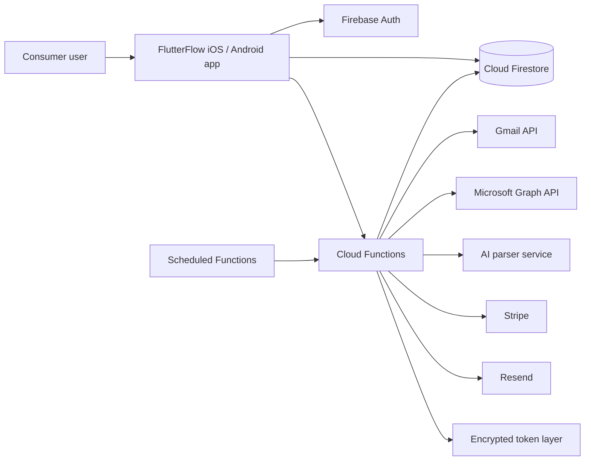
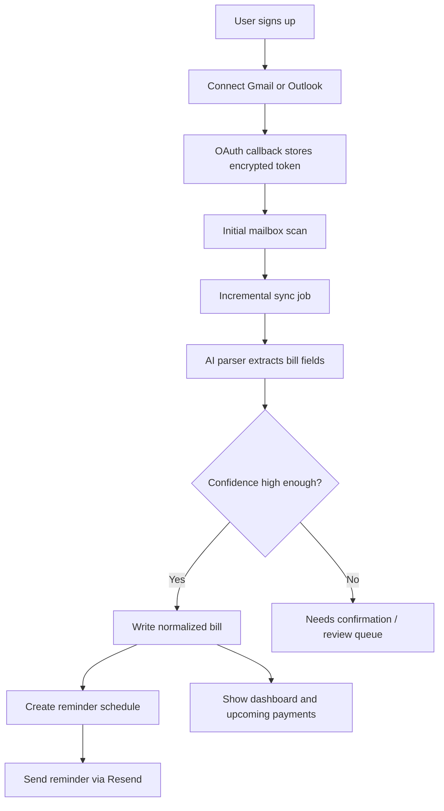
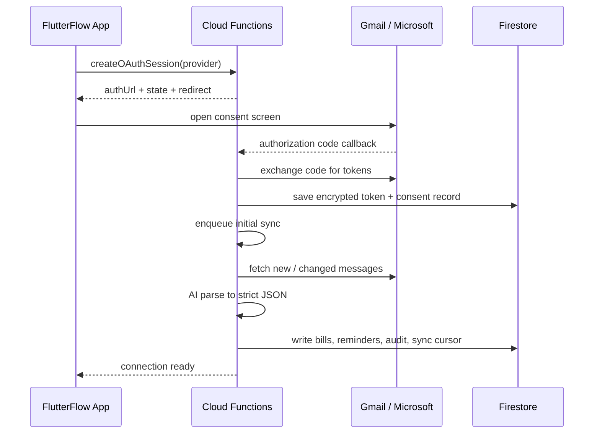
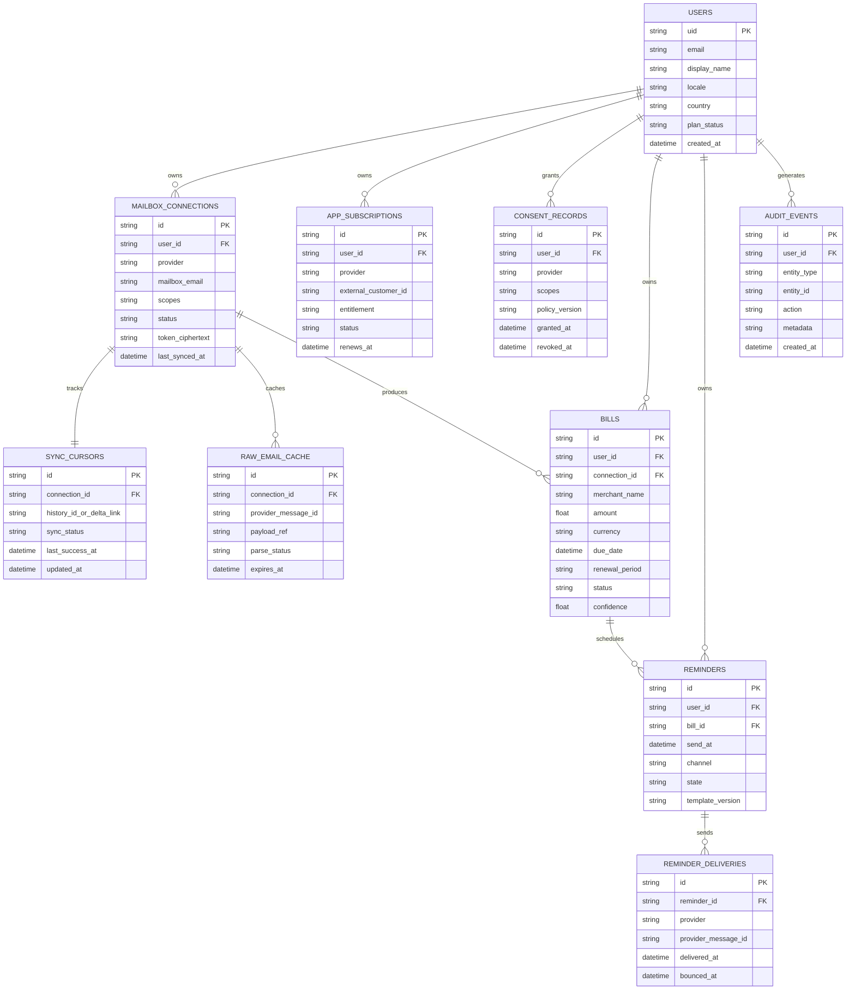
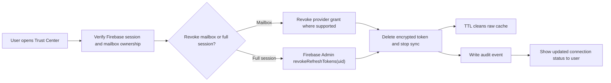

# Subscription Bill Management App

## Short answer

Yes, this app can be built with FlutterFlow + Firebase, but two items have to be treated as week-1 blockers, not week-9 polish:

- Gmail mailbox access is a Google restricted scope problem, not just an OAuth coding task.
- iOS subscription monetization needs an App Store compliant payment decision before UI and backend flows are finalized.

## Reality check first

### 1. Gmail access is the biggest launch risk

If you need Gmail message body access for automated bill parsing, the obvious scope is `https://www.googleapis.com/auth/gmail.readonly`. Google classifies that scope as restricted. Google also says restricted-scope apps that store or transmit that data must complete a security assessment, and its help center lists the expected timeline for restricted-scope verification as about 6 weeks. Google also caps unverified apps and requires annual recertification for restricted-scope apps.

Practical impact:

- Start Google verification in week 1, in parallel with development.
- Assume privacy policy, terms, verified domain, demo video, test accounts, and data-deletion flow are launch-critical deliverables.
- Keep raw email retention very short.

### 2. Stripe inside iOS is not automatically App Store safe

Apple's review guidelines say that if you unlock app features or functionality inside the app, you must use In-App Purchase. Apple also allows some exceptions for reader apps, multiplatform services, and free companion apps, but those rules change the product design.

Practical impact:

- Safest iOS path: use Apple In-App Purchase for iOS entitlements, keep Stripe for web and back office if needed.
- Alternative path: keep the iOS app as a free companion to a paid web product with no in-app purchase CTA. This needs careful review before build.
- Do not leave this decision for later because it affects onboarding, paywall screens, entitlement logic, and review notes.

## Recommended build approach

### Product architecture

1. Use FlutterFlow only for presentation, navigation, app state, localization, and safe Firestore reads.
2. Put every sensitive workflow in Cloud Functions:
   - Gmail and Outlook OAuth
   - token storage and revocation
   - inbox sync jobs
   - AI parsing
   - Stripe webhooks
   - reminder dispatch
3. Use Firebase Auth for app identity and keep mailbox connections separate from app login.
4. Use Cloud Firestore as the source of truth for users, mailbox connections, normalized bills, reminders, audit events, and entitlements.
5. Use AI only behind the server and require strict JSON output with a schema, confidence score, and anomaly flags.

### Data architecture

Recommended long-lived data:

- user profile
- mailbox connection metadata
- consent records
- normalized bill entities
- reminder schedules
- reminder delivery logs
- subscription entitlements
- audit trail

Recommended short-lived data only:

- raw email bodies or parsed raw payloads
- AI prompt/response debug payloads
- temporary sync job artifacts

Use a TTL policy for the short-lived collections.

### Security model

1. Store refresh tokens encrypted at rest, not in plaintext.
2. Keep provider secrets out of the client.
3. Verify Firebase ID tokens in Cloud Functions for every sensitive action.
4. Support one-tap mailbox disconnect, token revocation, and account deletion.
5. Log every consent grant, sync run, reminder send, revoke action, and deletion event.
6. Show the user which mailbox is connected, what was granted, and when the last sync happened.

### Inbox ingestion model

Recommended MVP:

- Gmail: filtered scans plus incremental sync cursor strategy
- Outlook: Microsoft Graph delta query
- schedule: every 15 to 30 minutes
- parse only candidate billing messages
- normalize to a bill record
- confidence below threshold goes to review queue or "needs confirmation"

This is much safer than trying to treat every email as parseable billing content.

## What you need on your Mac

### Hardware

- Apple silicon Mac strongly recommended
- 16 GB RAM minimum, 24 GB or 32 GB preferred
- 512 GB SSD minimum
- one real iPhone for device testing
- one real Android phone if Android release matters in the same cycle

### macOS / Xcode

As of May 29, 2026, Apple's Xcode support matrix says:

- Xcode 26.5 requires macOS Tahoe 26.2 or later
- Xcode 16.4 supports macOS Sequoia 15.3 through macOS Tahoe 26.1.x

If you are setting up a fresh machine, the safe advice is: use the latest stable macOS version that supports the latest stable Xcode available to you.

### Core software to install

- Xcode
- Xcode Command Line Tools
- Homebrew
- CocoaPods
- Flutter SDK
- Firebase CLI
- Node.js LTS
- Git
- Android Studio for emulator / Android SDK management
- FlutterFlow account with GitHub sync enabled

### Accounts and external setup you will need

- Apple Developer Program membership
- Google Play Console account
- Firebase / Google Cloud project
- Google Cloud OAuth consent screen and verified domain
- Microsoft Entra app registration
- Stripe account
- Resend account
- production domain for privacy policy, terms, support, OAuth redirects, and app-site verification

## Recommended cloud region choices for Spain launch

- Firestore: `eur3` multi-region if availability matters most, or `europe-southwest1` / Madrid if regional simplicity and proximity matter more
- Functions: place them close to Firestore to reduce latency and cost
- App language: Spanish first, English second
- Currency: EUR
- Time zone defaults: Europe/Madrid, but keep per-user time zone storage

Note:
The Firebase docs recommend choosing Cloud Functions close to the Firestore instance location.

## Excalidraw board

Editable board:

- `docs/diagrams/bill-management-app-architecture.excalidraw`

Generator:

- `docs/diagrams/generate-bill-management-architecture-excalidraw.mjs`

The board contains five frames:

- `1. System Architecture`
- `2. Working Flow`
- `3. API / OAuth Flow`
- `4. Firestore Logical ER Diagram`
- `5. Security / Revocation Flow`

## System architecture preview

## Working flow preview

## OAuth and API flow preview

## Firestore logical ERD

Important:
This is a logical ERD for planning. In Firestore, these are collections keyed by `userId`, `connectionId`, and `billId`, not SQL joins.

## Security and revocation flow preview

## 10-week action plan

1. Week 1: architecture freeze, Firestore schema, FlutterFlow project setup, Firebase environments, Google verification package, Apple payment decision.
2. Week 2: screen-by-screen FlutterFlow translation of onboarding, auth, home, settings, and trust screens from the v8 HTML reference.
3. Week 3: Gmail and Outlook OAuth flows, callback endpoints, encrypted token persistence, consent logging.
4. Week 4: initial inbox scan, sync cursor strategy, provider filtering, retry and idempotency logic.
5. Week 5: AI parsing pipeline, structured output schema, confidence scoring, manual confirmation flow for weak parses.
6. Week 6: bill list, calendar / due date views, upcoming reminders, subscription / renewal change handling.
7. Week 7: reminder engine with Resend, templates, timezone handling, delivery logs, user controls.
8. Week 8: monetization and entitlements: Stripe web path and/or App Store / Play billing path, webhook updates, paywall state.
9. Week 9: security hardening, revoke flows, delete-account flow, privacy policy alignment, analytics, QA.
10. Week 10: TestFlight / Play internal testing, app-store assets, bug fixes, submission, review support.

## First decisions to lock before development starts

1. iOS monetization path:
   - Apple IAP for iOS plus Stripe for web
   - or companion-app model with no in-app purchase CTA
2. Gmail scope choice:
   - `gmail.readonly` if message body parsing is required
   - `gmail.metadata` only if you can live without body access
3. AI provider:
   - exact vendor
   - data retention settings
   - DPA and privacy review
4. Raw email retention:
   - 0 hours
   - 24 hours
   - 72 hours
5. Reminder channels:
   - Resend email only at launch
   - or email plus push later

## Official references checked

- FlutterFlow Apple App Store deployment guide: https://docs.flutterflow.io/deployment/apple-app-store-deployment/
- Apple Xcode support matrix: https://developer.apple.com/support/xcode/
- Apple Developer Program membership details: https://developer.apple.com/programs/whats-included/
- Apple App Review Guidelines: https://developer.apple.com/app-store/review/guidelines/
- Gmail API scopes: https://developers.google.com/workspace/gmail/api/auth/scopes
- Google OAuth verification FAQ: https://support.google.com/cloud/answer/13463817?hl=en
- Google unverified apps guidance: https://support.google.com/cloud/answer/7454865?hl=en
- Google annual recertification for restricted scopes: https://support.google.com/cloud/answer/13463816?hl=en
- Microsoft Graph permissions reference: https://learn.microsoft.com/en-us/graph/permissions-reference
- Microsoft Graph delta query for messages: https://learn.microsoft.com/en-us/graph/delta-query-messages
- Microsoft offline access scopes: https://learn.microsoft.com/en-us/entra/identity-platform/scopes-oidc
- Firebase session revocation: https://firebase.google.com/docs/auth/admin/manage-sessions
- Firestore TTL: https://firebase.google.com/docs/firestore/ttl
- Cloud Functions locations: https://firebase.google.com/docs/functions/locations
- Cloud Firestore locations: https://firebase.google.com/docs/firestore/locations
- Google Play setup and fee: https://support.google.com/googleplay/android-developer/answer/6112435?hl=en
